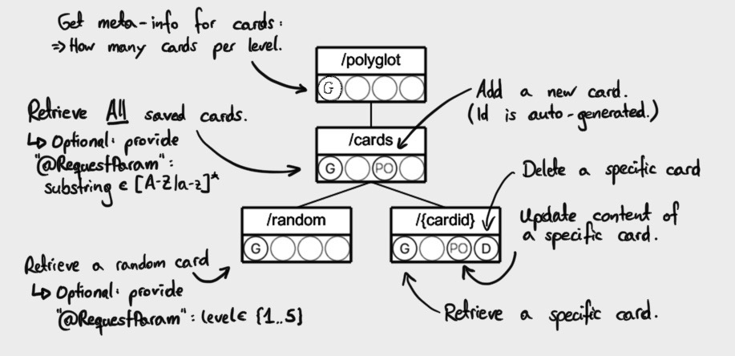

# API

## Layers

Details for the various application layers:

### Web Front-End

The frontend consists of the following pages and functionality:


 * Landing page
   * 5 buttons to select the desired difficulty (implicitly shows current fill state)
   * Add-Card button, to feed new cards to the system
   * Import button, to upload a set of cards from file
   * Export button, to save previously added cards as file
 * Add a new card page
   * Card form with two lines
     * Statement in native language (revealed)
     * Statement in foreign language (concealed)
   * Submit button
   * Button to go back to Landing page
 * Training page
   * Card form with two lines
     * Statement in native language (revealed)
     * Statement in foreign language (concealed)
   * Option to reveal solution
   * Option to verify a submitted solution
   * Button to go back to Landing page

 > **Note:** The entire UI can be controlled by key-commands. Those are indicated in brackets, e.g. ```e``` to access the ```[E]xport``` menu.

### REST-API

This section describes the server-side REST API.

#### RIF model

The REST resources are arranged as indicated in the RIF model below. Some resources support optional parameters.



 > **Note:** ```/api``` is common prequel to all REST calls, for clear distinction to web-ui URIs.

#### Curl sample statements

 * Get box fill state:  
```bash
curl -X GET http://127.0.0.1:8444/polyglot/api
```
 * Retrieve all cards:  
```bash
curl -X GET http://127.0.0.1:8444/polyglot/api/cards
```
 * Submit new cards:  
```bash
curl -H 'Content-type:application/json' -X POST http://127.0.0.1:8444/polyglot/api/cards --data '[{"french":"grenouille (f)","german":"Frosch (m)"}, {"french":"voiture (f)","german":"Auto (n)"}]'
```
 * Reset the entire database / remove all cards:  
```bash
curl -X DELETE http://localhost:8444/polyglot/api/cards
```
 * Retrieve a random card (of any level / a specific level)
```bash
curl -X GET http://127.0.0.1:8444/polyglot/api/cards/random
curl -X GET http://127.0.0.1:8444/polyglot/api/cards/random?level=3
```

 * Retrieve a specific card, identified by id:  
```bash
curl -X GET http://127.0.0.1:8444/polyglot/api/cards/42
```
 * Modify a specific card, identified by id:  
```bash
curl -H 'Content-type:application/json' -X POST http://127.0.0.1:8444/polyglot/api/cards/3 --data '{"id":3,"french":"amour (f)","german":"Liebe (f)","box":3}'
```
 * Delete a specific card, identified by id:  
```bash
curl -X DELETE http://127.0.0.1:8444/polyglot/api/cards/42
```

 > **Note:** All above entry points are declared in [```CardController.java```](src/main/java/eu/kartoffelquadrat/polyglot/CardController.java)


#### Import / Export

As documented above, the API supports import and export of the database via REST calls. The body paylod is in both cases a JSON file.

 * [Sample import / export JSON file](documentation/ie-sample.json)
 * [General JSON schema for import / export JSON files](documentation/ie-schema.json).

 > [jsonvalidator.net](https://www.jsonschemavalidator.net/) offers free browser based validation of JSON samples against schema definitions.

### Database

The actual vocabulary is persisted in a mySQL database. There is only one table: ```polycglot.card```. Every line represents a vocabulary card with two language entries, an id and a box. The latter represents the cards positioning in a vocabulary box with 5 spaces.

Sample:  
```SQL
mysql> SELECT * FROM card;
+----+-----+----------------------------+-------------------------+
| id | box | french                     | german                  |
+----+-----+----------------------------+-------------------------+
|  1 |   3 | niaiser                    | herumblödeln            |
|  2 |   3 | biscuit (m)                | Keks (m)                |
|  3 |   2 | sans gluten                | glutenfrei              |
|  4 |   0 | torchon (m)                | Küchentuch (n)          |
|  5 |   1 | école de fôret imperiale   | imperiale waldorfschule |
|  6 |   0 | bac à sable (m)            | Sandkasten (m)          |
|  7 |   0 | abri antiatomique (m)      | Atomschutzbunker (m)    |
|  8 |   0 | nid d'oiseau (m)           | Vogelnest (n)           |
|  9 |   0 | étoile (f)                 | Stern (m)               |
| 10 |   0 | cocasse                    | drollig                 |
| 11 |   0 | pomme (f)                  | Apfel (m)               |
| 12 |   0 | subtil équilibre (m)       | Balanceakt (m)          |
| 13 |   0 | brique (f)                 | Ziegelstein (m)         |
| 14 |   0 | Raton laveur (m)           | Waschbär (m)            |
| 15 |   0 | Colibri (m)                | Kolibri (m)             |
| 16 |   0 | Pétale de rose (m)         | Rosenblatt (m)          |
| 17 |   2 | impasse (f)                | sackgasse (f)           |
+----+-----+----------------------------+-------------------------+
```
